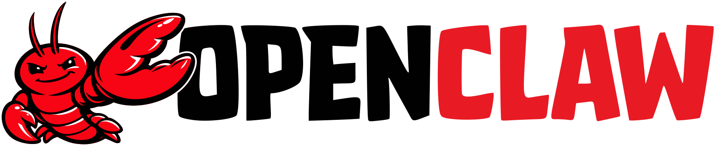

# Hi, I'm Stefanos 👋

- 🚀 Building [**Keeep**](https://keeep.dev) — AI-powered churn prevention for B2B SaaS
- 🔨 Always crafting projects, tools, and solutions that solve real problems
- 🏆 Hackathons are my playground — fast iterations, bold ideas, ship it
- 🎓 CS Student at [**AUEB**](https://aueb.gr)
- 📍 Athens, Greece

---

## 🛠 Tech Stack

  

  
  

  
  &nbsp;&nbsp;
  

---

## 📊 Stats

  

